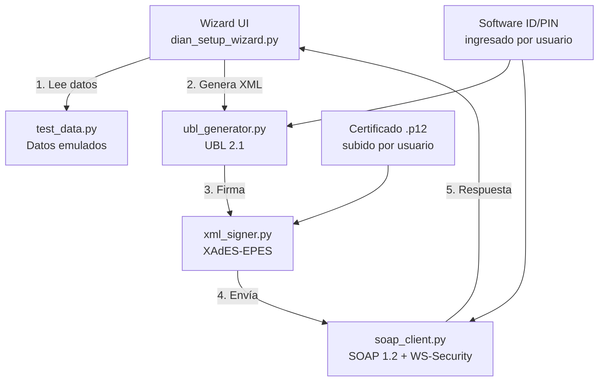

# Documentación Técnica: `insotech_dian_wizard`

## Resultado Final

> [!IMPORTANT]
> **Habilitación exitosa ante la DIAN** — 22 marzo 2026
> - StatusCode: `00` | IsValid: `true` | Estado: "Procesado Correctamente"
> - Empresa: Infinity Solutions Technology S.A.S. (NIT 901797249)
> - 15 errores de validación resueltos en una sola sesión

---

## 1. Arquitectura del Módulo



### Decisión de diseño: ¿Por qué un módulo separado?

El módulo nativo de Odoo (`l10n_co_dian`) requiere tener **facturas reales, contactos, productos y diarios configurados** antes de poder habilitarse. Esto es un problema para clientes SaaS nuevos que necesitan habilitarse **antes** de tener datos.

`insotech_dian_wizard` genera todo con **datos emulados**: no necesita productos, contactos, ni configuración contable previa. El cliente solo sube su `.p12` y pone Software ID/PIN.

---

## 2. Estructura de Archivos

```
insotech_dian_wizard/
├── __manifest__.py              # Metadatos del módulo Odoo
├── __init__.py
├── services/                    # Core — 100% independiente de Odoo
│   ├── __init__.py
│   ├── ubl_generator.py        # Genera XML UBL 2.1 (FV, NC, ND)
│   ├── xml_signer.py           # Firma XAdES-EPES con RSA-SHA256
│   ├── soap_client.py          # Cliente SOAP para API DIAN
│   └── test_data.py            # Datos emulados (emisor, receptor, montos)
├── wizard/
│   ├── __init__.py
│   └── dian_setup_wizard.py    # Wizard Odoo (UI + orquestación)
├── views/
│   └── dian_setup_wizard_views.xml  # Vista del formulario
└── security/
    └── ir.model.access.csv     # Permisos de acceso
```

---

## 3. Detalle por Archivo

### [ubl_generator.py](file:///home/david/odoo-projects/insotech/insotech_dian_wizard/services/ubl_generator.py)

**Qué hace:** Genera documentos XML conformes con UBL 2.1 y el Anexo Técnico DIAN 1.9.

**Funciones principales:**
| Función | Qué genera |
|---------|------------|
| `generate_invoice()` | Factura Electrónica (tipo 01) |
| `generate_credit_note()` | Nota Crédito (tipo 91) |
| `generate_debit_note()` | Nota Débito (tipo 92) |
| `_compute_cufe()` | Hash SHA-384 del CUFE |
| `_compute_cude()` | Hash SHA-384 del CUDE (para NC/ND) |
| `_add_party()` | Estructura de emisor/receptor |
| `_add_dian_extensions()` | Extensiones UBL requeridas por DIAN |

**Por qué así:** Cada función genera un documento completo desde cero usando datos de `test_data.py`. No depende de ningún modelo Odoo. Esto permite:
- Testear sin base de datos
- Portar a cualquier versión de Odoo
- Reutilizar el generador para facturación real en el futuro

---

### [xml_signer.py](file:///home/david/odoo-projects/insotech/insotech_dian_wizard/services/xml_signer.py)

**Qué hace:** Aplica firma digital XAdES-EPES al XML usando el certificado `.p12` del cliente.

**Elementos de la firma:**
- `SignatureMethod`: RSA-SHA256
- `DigestMethod`: SHA-256
- `SignaturePolicyIdentifier` (v2) — política de firma DIAN
- `SigningCertificate` — cadena completa de certificados
- `SignerRole` — `supplier`

**Por qué XAdES-EPES:** La DIAN exige XAdES-EPES (no XAdES-BES ni XMLDSig simple). La política de firma v2 de la DIAN debe estar referenciada con su hash exacto.

---

### [soap_client.py](file:///home/david/odoo-projects/insotech/insotech_dian_wizard/services/soap_client.py)

**Qué hace:** Envía documentos a la API SOAP de la DIAN.

**Endpoints:**
| Método | Endpoint | Uso |
|--------|----------|-----|
| `send_bill_sync()` | `SendBillSync` | Prueba individual (feedback inmediato) |
| `send_test_set_async()` | `SendTestSetAsync` | Envío del set completo |
| `get_status_zip()` | `GetStatusZip` | Consultar resultado del batch |

**Por qué `SendBillSync` primero:** `SendTestSetAsync` enmascara errores — solo dice "batch en proceso". `SendBillSync` retorna errores detallados regla por regla. Por eso probamos 1 factura individual antes del batch.

---

### [test_data.py](file:///home/david/odoo-projects/insotech/insotech_dian_wizard/services/test_data.py)

**Qué hace:** Contiene todos los datos emulados para generar el set de pruebas.

**Datos del EMISOR (InSoTech):**
```python
EMITTER = {
    'nit': '901797249',
    'registration_name': 'INFINITY SOLUTIONS TECHNOLOGY SAS',
    'city_code': '11001',      # Bogotá
    'department_code': '11',
    'address_line': 'CR 7 6 C 54',
    ...
}
```

**Datos del RECEPTOR (pruebas):**
```python
RECEIVER = {
    'nit': '800199436',        # Persona jurídica de prueba
    'document_type': '31',     # NIT
    'additional_account_id': '1',  # Persona jurídica
    ...
}
```

> [!WARNING]
> **Datos hardcodeados de InSoTech.** Para vender a otros clientes, estos datos deben venir del wizard (ingresados por el usuario) o de `res.company`. Ver sección "Roadmap" al final.

---

### [dian_setup_wizard.py](file:///home/david/odoo-projects/insotech/insotech_dian_wizard/wizard/dian_setup_wizard.py)

**Qué hace:** Orquesta todo el proceso de habilitación desde la UI de Odoo.

**Campos del wizard:**
| Campo | Tipo | Fuente |
|-------|------|--------|
| `cert_file` | Binary | Subido por usuario |
| `cert_password` | Char | Ingresado por usuario |
| `software_id` | Char | Del portal DIAN |
| `software_pin` | Char | Del portal DIAN |
| `test_set_id` | Char | Del portal DIAN |
| `technical_key` | Char | Default fijo (del portal) |
| `num_invoices` / `num_credit_notes` / `num_debit_notes` | Integer | Configurable |

**Flujo de ejecución:**
1. Carga certificado → extrae clave privada y certificado PEM
2. Genera XMLs (FV + NC + ND) con números dinámicos (timestamp offset para evitar Regla 90)
3. Prueba 1 factura con `SendBillSync` → muestra errores detallados
4. Si pasa, envía batch completo con `SendTestSetAsync`
5. Consulta resultado con `GetStatusZip`

---

## 4. Los 15 Errores DIAN Resueltos

| # | Regla | Descripción | Causa raíz | Fix |
|---|-------|-------------|-----------|-----|
| 1 | ZB01 | Schema de firma inválido | `SignaturePolicy` → debe ser `SignaturePolicyId` | [xml_signer.py](file:///home/david/odoo-projects/insotech/insotech_dian_wizard/services/xml_signer.py) |
| 2 | FAB31 | Falta AuthorizationProvider | No incluía NIT de la DIAN en extensiones | [ubl_generator.py](file:///home/david/odoo-projects/insotech/insotech_dian_wizard/services/ubl_generator.py) |
| 3 | FAB36 | Falta QR Code | No se generaba URL del QR | ubl_generator.py |
| 4 | FAN02 | PaymentMeans inválido | Faltaban ID, PaymentDueDate, PaymentID | ubl_generator.py |
| 5 | FAB35 | Tipo documento receptor | Tipo de documento incorrecto | [test_data.py](file:///home/david/odoo-projects/insotech/insotech_dian_wizard/services/test_data.py) |
| 6 | FAK24 | DV incorrecto | Dígito de verificación mal calculado | test_data.py |
| 7 | Regla 90 | Documento duplicado | Consecutivos repetidos entre intentos | [dian_setup_wizard.py](file:///home/david/odoo-projects/insotech/insotech_dian_wizard/wizard/dian_setup_wizard.py) (timestamp offset) |
| 8 | CBF03a | CustomizationID | Valor no conforme al catálogo | ubl_generator.py |
| 9 | FBE01 | AllowanceCharge | Faltaba en líneas de factura | ubl_generator.py |
| 10 | **FAB10a** | Prefijo ≠ sucursal | Faltaba `CorporateRegistrationScheme` con `<ID>SETP</ID>` | ubl_generator.py |
| 11 | **FAJ28** | Dirección incompleta | RegistrationAddress sin `AddressLine > Line` | ubl_generator.py |
| 12 | **FAK28** | RegistrationAddress faltante | Mismo fix que FAJ28 | ubl_generator.py |
| 13 | **FAD03** | ProfileID incorrecto | DIAN 1.9 requiere `'DIAN 2.1: Factura Electrónica de Venta'` (con sufijo) | ubl_generator.py |
| 14 | FAK61 | AdditionalAccountID | `2` (persona natural) no es válido con NIT persona jurídica | test_data.py |
| 15 | **FAD06** | **CUFE incorrecto** | **Typo en Clave Técnica: `c8f` en vez de `c6f`** | dian_setup_wizard.py línea 41 |

> [!CAUTION]
> **FAD06 fue causado por UN solo carácter errado en la Clave Técnica hardcodeada.** Esto demuestra la importancia de tener debug visible (el campo `CUFE raw` en el wizard) para diagnosticar problemas de hash.

---

## 5. Fórmula del CUFE (Verificada)

```
SHA384(NumFac + FecFac + HorFac + ValFac + CodImp1 + ValImp1 
       + CodImp2 + ValImp2 + CodImp3 + ValImp3 + ValTot 
       + NitOFE + NumAdq + ClTec + TipoAmbie)
```

**Ejemplo real aceptado por la DIAN:**
```
SETP992235166 2026-03-23 03:06:06-05:00 100000.00 01 19000.00 
04 0.00 03 0.00 119000.00 901797249 800199436 
fc8eac422eba16e22ffd8c6f94b3f40a6e38162c 2
```

| Campo | Valor | Notas |
|-------|-------|-------|
| CodImp1 | `01` | IVA |
| CodImp2 | `04` | INC (no ICA) |
| CodImp3 | `03` | ICA (no INC) |
| ValTot | `119000.00` | = PayableAmount |
| ClTec | 40 chars hex | De la DIAN, fija por resolución |
| TipoAmbie | `2` | Habilitación |

---

## 6. Fuentes de Referencia

| Recurso | Ubicación |
|---------|-----------|
| Caja de Herramientas DIAN v1.8 | [Documentacion/Caja_de_herramientas_Factura_Electronica...](file:///home/david/odoo-projects/insotech_l10n_co_advanced/Documentacion/Caja_de_herramientas_Factura_Electronica_Validacion_Previa_) |
| XML ejemplo Genérica | `Version 1.8/Ejemplificaciones/XMLs de ejemplo/Generica.xml` |
| XML ejemplo Consumidor Final | `Version 1.8/Ejemplificaciones/XMLs de ejemplo/Consumidor Final.xml` |
| Aprendizajes DIAN | [aprendizajes/dian-habilitacion-facturacion-electronica.md](file:///home/david/odoo-projects/insotech_l10n_co_advanced/.agent/skills/base-de-conocimiento/aprendizajes/dian-habilitacion-facturacion-electronica.md) |
| Propuesta Diagnóstico Inteligente | [PROPUESTA_DIAGNOSTICO_INTELIGENTE_DIAN.md](file:///home/david/odoo-projects/insotech_l10n_co_advanced/Documentacion/propuestas/PROPUESTA_DIAGNOSTICO_INTELIGENTE_DIAN.md) |

---

## 7. Roadmap: Wizard Self-Service (Próxima Fase)

Para hacer el wizard vendible sin intervención de InSoTech:

**Campos a agregar al wizard:**
- NIT del emisor
- Razón Social
- Dirección (como aparece en el RUT)
- Código de ciudad DANE
- Departamento
- Email y teléfono

**Cambio en `ubl_generator.py`:**
- `_add_party()` recibe datos del wizard en vez de `test_data.EMITTER`
- `test_data.py` se convierte en valores por defecto, no en la fuente de verdad

**Resultado esperado:** El cliente llena el formulario → click → habilitado. Sin soporte técnico.
