# PARTE A: Trámites ante la DIAN (Portal MUISCA)

> **Guía Maestra de Facturación Electrónica DIAN — Odoo 19**
> Versión: 2.0 | Fecha: Marzo 2026

---

## Índice de esta sección

| Paso | Descripción | Prereq. | Entregable |
|------|-------------|---------|------------|
| A.1 | Actualización del RUT | Acceso MUISCA | RUT con código 52 |
| A.2 | Certificado de Firma Digital | Presupuesto aprobado | Archivo `.p12` + contraseña |
| A.3 | Registro en Portal de Habilitación | RUT actualizado | Cuenta activa en catalogo-vpfe |
| A.4 | Software Propio: Credenciales de Prueba | Registro completado | Software ID, PIN, Test Set ID |
| A.5 | Solicitud de Resolución (Producción) | RUT actualizado | Número de Resolución, prefijo, rangos |
| A.6 | Asociar Rangos y Clave Técnica | Resolución otorgada + Software habilitado | Clave Técnica por prefijo |
| A.7 | Notas Normativas 2026 | — | Conocimiento actualizado |

> [!TIP]
> Guarde **todos** los datos que obtenga en cada paso en una hoja de cálculo segura. Los necesitará en la Parte B (Configuración en Odoo).

> [!IMPORTANT]
> **Dos entornos, dos portales.** La DIAN opera con un entorno de **Pruebas (Habilitación)** y otro de **Producción**. Cada uno tiene su propio portal, credenciales y prefijos. A lo largo de esta guía diferenciamos claramente cuál se usa en cada paso:
>
> | Aspecto | 🧪 Pruebas (Habilitación) | 🚀 Producción |
> |---------|---------------------------|---------------|
> | **Portal** | `catalogo-vpfe-hab.dian.gov.co` | `catalogo-vpfe.dian.gov.co` |
> | **Prefijo** | `SETP` (asignado por la DIAN, no se puede cambiar) | El que usted elija (ej. `FE`) |
> | **Resolución** | `18760000001` (genérica de pruebas) | La que le asignen en MUISCA |
> | **Uso** | Completar el Set de Pruebas (50 docs) | Facturación real |

---

## A.1 Actualización del RUT

### ¿Qué es?

El RUT (Registro Único Tributario) es la cédula fiscal de su empresa ante la DIAN. Para facturar electrónicamente, su RUT **debe** incluir la responsabilidad de "Facturador Electrónico".

### ¿Quién lo hace?

El **Representante Legal** de la empresa, o un contador/abogado con poder autenticado.

### Paso a paso

1. Ingrese a [muisca.dian.gov.co](https://muisca.dian.gov.co) con las credenciales del Representante Legal.
2. Navegue a **Registro Único Tributario (RUT) → Actualización RUT**.
3. En la sección **Responsabilidades**, verifique que estén marcadas:

| Código | Descripción | ¿Obligatorio? |
|--------|------------|---------------|
| **52** | Facturador Electrónico | ✅ Sí — sin esto la DIAN no le permite emitir |
| **48** | Responsable de IVA | Según su régimen tributario |
| **49** | No Responsable de IVA | Según su régimen tributario (excluyente con 48) |

4. Si alguna responsabilidad falta, agréguela y guarde los cambios.
5. **Descargue el RUT actualizado en PDF** y archívelo — lo necesitará como referencia constante.

### Verificación

- [ ] El RUT descargado muestra el código **52** en la sección de Responsabilidades.
- [ ] Los datos de Razón Social, NIT y dirección son correctos y actualizados.

> [!CAUTION]
> Cada dato del RUT (Razón Social, dirección, NIT) debe coincidir **exactamente** con lo que configure en Odoo. Una sola discrepancia causará rechazo de la DIAN con error **FAJ44b**.

---

## A.2 Adquisición del Certificado de Firma Digital (.p12)

### ¿Qué es?

El certificado digital es su "firma electrónica" ante la DIAN. Es un archivo criptográfico (`.p12` o `.pfx`) que Odoo usa internamente para firmar cada XML de factura electrónica antes de enviarlo. Sin este certificado, la DIAN no acepta ningún documento.

### ¿Quién lo emite?

Únicamente entidades certificadoras autorizadas por la **ONAC** (Organismo Nacional de Acreditación de Colombia). Las tres más utilizadas en Colombia son:

| Entidad | Sitio web | Costo aprox. anual |
|---------|-----------|-------------------|
| **GSE** | [www.gse.com.co](https://www.gse.com.co) | $100.000 – $200.000 COP |
| **Certicámara** | [www.certicamara.com](https://www.certicamara.com) | $150.000 – $300.000 COP |
| **Andes SCD** | [www.andesscd.com.co](https://www.andesscd.com.co) | $100.000 – $250.000 COP |

### Paso a paso

1. **Contacte al proveedor** elegido y solicite un *Certificado de Firma Digital para Facturación Electrónica*.
2. **Especifique que necesita formato `.p12` o `.pfx`** — ambos son compatibles con Odoo. Algunos proveedores ofrecen otros formatos (`.cer`, `.key`) que Odoo **no acepta** directamente.
3. **Complete el proceso de validación de identidad** — generalmente requiere:
   - Copia del RUT actualizado (paso A.1).
   - Cédula del Representante Legal.
   - Cámara de Comercio vigente (para personas jurídicas).
   - Videollamada o presencia física para verificación biométrica.
4. **Reciba y almacene de forma segura:**

| Entregable | Descripción | Dónde lo usará |
|------------|-------------|----------------|
| Archivo `.p12` | El certificado digital propiamente dicho | Se sube a Odoo (Fase 3 de la Parte B) |
| Contraseña del certificado | Clave alfanumérica para usar el `.p12` | Se ingresa en Odoo junto al archivo |

5. **Anote la fecha de vencimiento** del certificado (generalmente 1 año). Programe un recordatorio para renovarlo al menos 30 días antes.

### Verificación

- [ ] Tiene el archivo `.p12` descargado y almacenado en una ubicación segura.
- [ ] Conoce y ha probado la contraseña del certificado.
- [ ] Ha registrado la fecha de vencimiento del certificado.

> [!WARNING]
> **Seguridad del certificado:** Trate el archivo `.p12` como una contraseña maestra. Cualquier persona con acceso a este archivo y su contraseña puede firmar documentos electrónicos en nombre de su empresa. No lo comparta por correo electrónico ni lo almacene en carpetas compartidas sin cifrado.

> [!NOTE]
> **Tiempo estimado:** El proceso de adquisición puede tomar entre 2 y 10 días hábiles dependiendo del proveedor y la rapidez con que complete la validación de identidad.

---

## A.3 Registro como Facturador Electrónico en el Portal de Habilitación

### ¿Qué es?

El portal de habilitación es el entorno de la DIAN donde su empresa se registra oficialmente como emisor de documentos electrónicos. Es diferente del portal MUISCA principal — este es específicamente para el proceso de habilitación de facturación electrónica.

### ¿Cuál es la URL?

- **Portal de habilitación (pruebas):** [catalogo-vpfe-hab.dian.gov.co](https://catalogo-vpfe-hab.dian.gov.co)
- **Portal de producción:** [catalogo-vpfe.dian.gov.co](https://catalogo-vpfe.dian.gov.co/User/Login)

> [!IMPORTANT]
> No confunda estos portales con el MUISCA principal (`muisca.dian.gov.co`). Son portales diferentes con funciones distintas:
> - **MUISCA** → Solicitar resoluciones de numeración (paso A.5)
> - **Habilitación** (`catalogo-vpfe-hab`) → Registrar Software Propio, obtener credenciales de prueba, enviar Set de Pruebas
> - **Producción** (`catalogo-vpfe`) → Asociar rangos de producción y obtener la Clave Técnica

### Paso a paso

1. Ingrese a [catalogo-vpfe-hab.dian.gov.co](https://catalogo-vpfe-hab.dian.gov.co).
2. Autentíquese con:
   - **NIT** de la empresa (sin dígito de verificación).
   - **Credenciales** del Representante Legal.
3. Navegue a **Participantes → Facturador**.
4. Confirme que desea iniciar su proceso de habilitación como facturador electrónico.
5. El sistema le mostrará un panel con el estado de su habilitación — inicialmente estará en **"Pendiente"**.

### Verificación

- [ ] Puede ingresar al portal de habilitación sin errores.
- [ ] El estado de su empresa como "Facturador" se muestra correctamente.
- [ ] Puede navegar por los menús del portal sin restricciones de acceso.

---

## A.4 Registro de "Software Propio" y Obtención de Credenciales de Prueba

### ¿Qué es?

Este es el paso donde le indica a la DIAN que **Odoo** será su sistema de facturación electrónica, operando bajo la modalidad de "Software Propio". La DIAN le entregará credenciales para el **entorno de pruebas** que Odoo necesita para completar el proceso de certificación.

> [!NOTE]
> **¿Por qué "Software Propio"?** En Colombia existen dos modalidades de facturación electrónica:
> 1. **Proveedor Tecnológico:** Usted contrata a un intermediario (Carvajal, Cadena, SiigoIT, etc.) que se encarga del envío. Tiene un costo mensual recurrente.
> 2. **Software Propio:** Su ERP (Odoo) se comunica directamente con la DIAN. Sin intermediarios. **Esta es la opción que usamos.**

### Paso a paso

1. En el portal de **habilitación** ([catalogo-vpfe-hab.dian.gov.co](https://catalogo-vpfe-hab.dian.gov.co)), navegue a **Configuración → Configurar modos de operación**.
2. Seleccione el modo de operación: **Software Propio**.
3. Haga clic en **"Asociar"**.

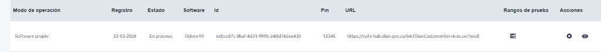

4. Al guardar, la plataforma DIAN le generará las credenciales de prueba. Haga clic en el ícono de **"Rangos de prueba"** (📋) de la fila correspondiente para ver el detalle completo:

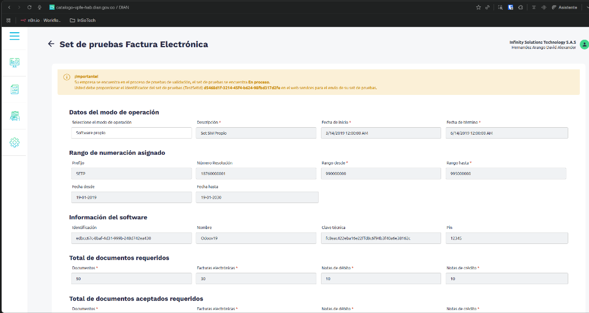

5. **Copie estos datos y guárdelos inmediatamente:**

| Dato | Qué es | Ejemplo real (pruebas) | Dónde lo usará en Odoo |
|------|--------|------------------------|------------------------|
| **Software ID** | Identificador único de su software ante la DIAN | `edbc67c-0baf-4d31-999b-248d742ea430` | Ajustes → Habilitación DIAN |
| **Software PIN** | PIN numérico de su software | `12345` | Ajustes → Habilitación DIAN |
| **Test Set ID** | Identificador del set de pruebas | `d546b61f-3214-45f4-b654-85fbc3f742fe` | Ajustes → Habilitación DIAN |
| **Clave Técnica (pruebas)** | Hash para firmar documentos de prueba | `fc8eac422eba16e22ffd8c6f94b3f40a6e38162c` | Diario temporal de pruebas |

> [!IMPORTANT]
> **Datos de prueba vs. Producción.** Las credenciales que obtiene aquí son exclusivas del entorno de **pruebas**. Observe los datos asignados automáticamente por la DIAN para el set de pruebas — son fijos y **no se pueden cambiar**:
>
> | Dato (pruebas) | Valor fijo |
> |----------------|------------|
> | Prefijo | `SETP` |
> | Nro. Resolución | `18760000001` |
> | Rango desde | `990000000` |
> | Rango hasta | `995000000` |

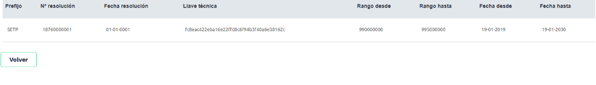

### 🔧 Módulo `insotech_dian_wizard`

El módulo **Insotech DIAN Setup Wizard** (`insotech_dian_wizard`) simplifica este proceso desde Odoo. En lugar de navegar por múltiples secciones de Ajustes, el wizard captura Software ID, PIN y Test Set ID en un solo formulario:

**Acceso:** Contabilidad → Configuración → Habilitación DIAN

El wizard almacena los datos en la empresa (`res.company`) y gestiona un flujo de estados:
- **Sin Configurar** → **En Proceso** → **Habilitado**

Consulte la [Documentación Técnica del Wizard](../../Documentacion/insotech_dian_wizard/DOCUMENTACION_TECNICA.md) para más detalles.

### Verificación

- [ ] Ha copiado y guardado el **Software ID**.
- [ ] Ha copiado y guardado el **Software PIN**.
- [ ] Ha copiado y guardado el **Test Set ID**.
- [ ] Ha copiado y guardado la **Clave Técnica de pruebas**.
- [ ] Puede volver a consultar estos datos en el portal si los necesita.

> [!CAUTION]
> **No pierda estos datos.** Si pierde el Test Set ID o el Software ID, deberá regenerarlos en el portal de habilitación (lo cual puede reiniciar su proceso de pruebas).

---

## A.5 Solicitud de Resolución de Facturación (Para Producción)

### ¿Qué es?

La Resolución de Facturación es la autorización oficial de la DIAN para que su empresa emita facturas electrónicas dentro de un rango numérico específico y un periodo de vigencia definido. Sin resolución vigente, no puede facturar legalmente.

> [!NOTE]
> **¿Cuándo hacer este paso?** La solicitud de resolución se realiza en el portal MUISCA (no en habilitación) y puede hacerse en **cualquier momento** — antes o después de completar el Set de Pruebas. Sin embargo, la resolución solo podrá asociarse a su software una vez que este pase a estado **"Aceptado"** en el portal de habilitación.

### Paso a paso

1. Ingrese al portal principal de **MUISCA**: [muisca.dian.gov.co](https://muisca.dian.gov.co).
2. Navegue a **Facturación → Numeración de Facturación → Solicitud de Numeración**.

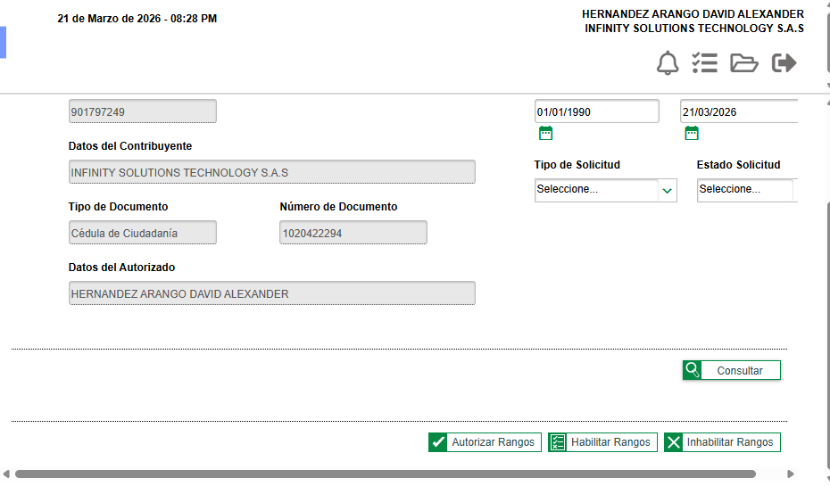

3. Haga clic en **"Autorizar Rangos"** (botón verde en la parte inferior).
4. Complete los campos requeridos:

| Campo | Qué poner | Ejemplo |
|-------|-----------| --------|
| **Prefijo** | Letras que identificarán sus facturas | `FE` |
| **Tipo Facturación** | Factura Electrónica de Venta | Seleccionar del menú |
| **Rango Desde** | Primer número de la serie | `1` |
| **Rango Hasta** | Último número de la serie | `5000` |

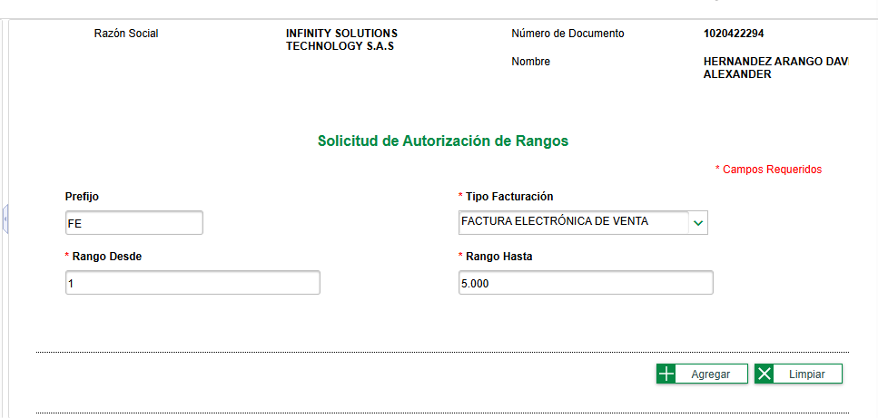

5. Haga clic en **"Agregar"** para añadir el rango a la solicitud.

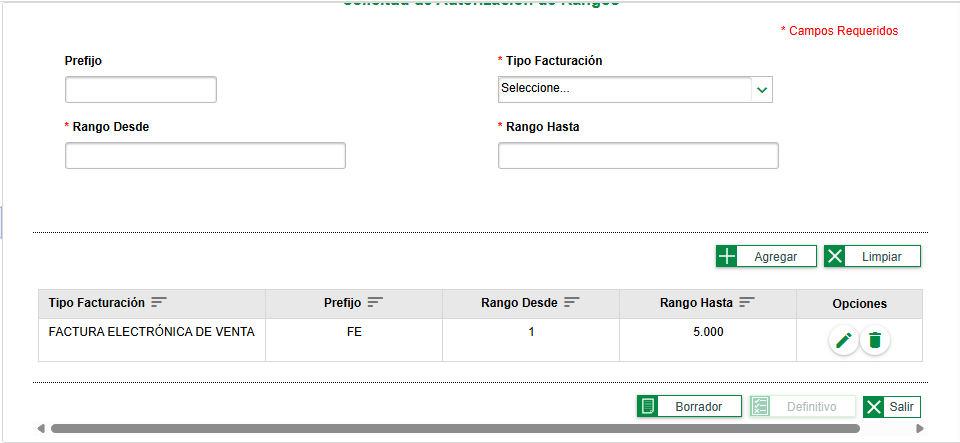

6. Haga clic en **"Borrador"** para guardar la solicitud.

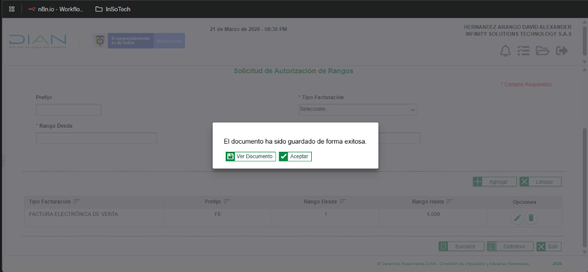

7. Haga clic en **"Aceptar"** para cerrar el popup, luego en **"Definitivo"** para formalizar la solicitud.

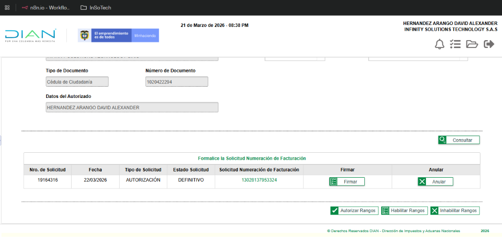

8. Haga clic en **"Firmar"** para firmar electrónicamente la solicitud. La DIAN procesará la solicitud y asignará el número de resolución.

> [!WARNING]
> **No haga clic en "Anular"** — eso cancela toda la solicitud y deberá repetir el proceso.

9. La DIAN asignará automáticamente:

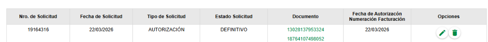

| Dato obtenido | Ejemplo real |
|---------------|--------------|
| **Nro. de Solicitud** | `19164316` |
| **Número de Resolución** | `18764107498052` |
| **Fecha de Autorización** | 22/03/2026 |
| **Estado** | DEFINITIVO ✅ |

10. **Descargue o imprima** la resolución otorgada — haga clic en el número de resolución para ver el detalle con fechas de vigencia.

### ¿Necesita resoluciones adicionales?

| Tipo de documento | ¿Necesita resolución propia? | Prefijo sugerido |
|---|---|---|
| Factura de Venta Electrónica | ✅ Siempre | `FE` |
| Nota Crédito Electrónica | ❌ No — usa la misma resolución de la factura de venta | — |
| Nota Débito Electrónica | ❌ No — usa la misma resolución de la factura de venta | — |
| Documento Soporte (compras a no obligados) | ✅ Sí, resolución independiente | `DS` |
| Factura de Exportación | ✅ Si exporta, resolución separada | `FEX` |

> [!TIP]
> **Práctica estándar en Odoo:** Las Notas Crédito y Notas Débito **no requieren resolución independiente**. Odoo genera estos documentos referenciando la factura original y comparten la misma resolución de facturación. Solo necesita resolución separada si su contador lo indica explícitamente.

### Verificación

- [ ] Tiene el número de resolución anotado.
- [ ] Conoce el prefijo, rango desde, rango hasta.
- [ ] Conoce las fechas de inicio y fin de vigencia.
- [ ] Si aplica, tiene resolución(es) adicional(es) para DS, FEX.

---

## A.6 Asociar Rangos y Obtener la Clave Técnica

### ¿Qué es?

La Clave Técnica es un hash criptográfico que la DIAN genera al vincular un prefijo de resolución con su software. Es un dato **obligatorio** para que Odoo pueda firmar y enviar facturas en producción. Sin la Clave Técnica, Odoo no puede generar el CUFE (Código Único de Factura Electrónica).

> [!IMPORTANT]
> **Requisito previo:** Este paso solo puede completarse cuando:
> 1. Su software tiene estado **"Aceptado"** en el portal de habilitación (Set de Pruebas completado).
> 2. La resolución de producción (paso A.5) ya fue aprobada y se sincronizó con el portal de producción.
>
> La sincronización entre MUISCA y el portal de producción puede tomar desde **unos minutos hasta unas horas**.

### Paso a paso

1. Ingrese al portal de **producción**: [catalogo-vpfe.dian.gov.co](https://catalogo-vpfe.dian.gov.co/User/Login) (⚠️ producción, **no** habilitación).
2. Navegue a **Configuración → Gestionar Asociación de Prefijos**.
3. Seleccione su **Proveedor - Software** en el dropdown (debe ser el software con estado "Aceptado").
4. Seleccione el **Prefijo** que desea asociar (ej. `FE - 18764107498052`).

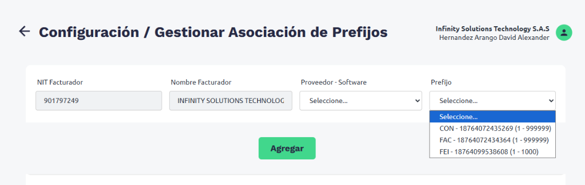

> [!WARNING]
> **Verifique el software correcto.** Si tiene múltiples registros de software (ej. "Odoo" antiguo y "Odoov19" nuevo), asegúrese de seleccionar el software **correcto y habilitado**. Asociar el prefijo al software equivocado causará que las facturas sean rechazadas.

5. Verifique que los datos sean correctos:

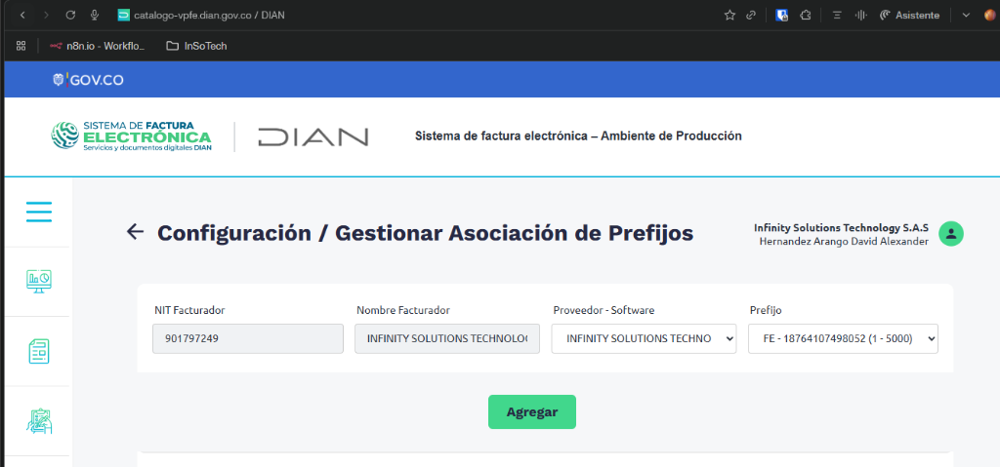

6. Haga clic en **"Agregar"**.
7. La asociación se completará y aparecerá en la tabla de resultados:

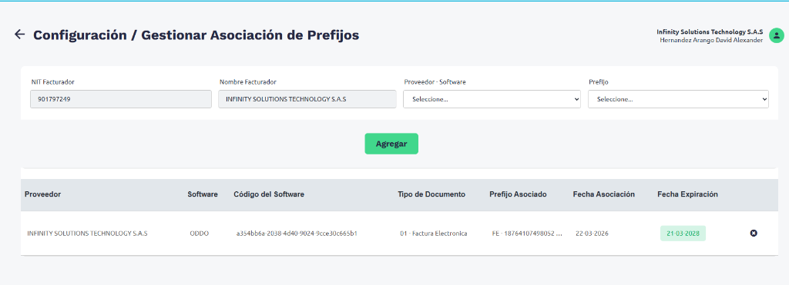

8. **Haga clic sobre la fila** para ver el detalle y obtener la **Clave Técnica** (un hash alfanumérico largo).
9. **Copie la Clave Técnica inmediatamente** — la necesitará en la configuración de diarios de Odoo.

### Datos obtenidos — Tabla de referencia

Para cada prefijo que haya asociado, debería tener un registro como este:

| Dato | Ejemplo real (Producción) |
|------|--------------------------|
| **Número de Resolución** | `18764107498052` |
| **Prefijo** | `FE` |
| **Rango Desde** | `1` |
| **Rango Hasta** | `5000` |
| **Fecha Asociación** | `22/03/2026` |
| **Fecha Expiración** | `21/03/2028` |
| **Software ID (producción)** | `a354bb6a-2038-4d40-9024-9cce30c665b1` |
| **Clave Técnica** | *(hash alfanumérico largo — se obtiene al hacer clic en la fila)* |

> [!IMPORTANT]
> **Repita este proceso para cada tipo de documento** que vaya a emitir. Si tiene resoluciones para FE y DS, necesita asociar los rangos y obtener la Clave Técnica para cada uno.

### Verificación

- [ ] Cada prefijo tiene su Clave Técnica anotada.
- [ ] Los rangos de numeración coinciden con lo que solicitó en A.5.
- [ ] Las fechas de vigencia están registradas.
- [ ] Verificó que asoció al software **correcto** (no al antiguo).

---

## A.7 Notas Normativas Vigentes (2026)

> [!NOTE]
> Esta sección resume las actualizaciones normativas recientes que pueden impactar su configuración. No requiere acción inmediata — es información de contexto para tomar decisiones informadas.

### Simplificación de Datos del Adquiriente (Resolución 000202)

La DIAN redujo a **máximo 3** los datos obligatorios del comprador para emitir una factura electrónica válida:

1. Nombre o Razón Social
2. Tipo y Número de Identificación (NIT / CC)
3. Correo Electrónico (solo si la entrega es digital)

**Impacto práctico:** Para facturación rápida (ej. punto de venta), ya no es obligatorio solicitar la dirección completa del comprador. Sin embargo, para facturación B2B conviene tener los datos completos para evitar rechazos.

### Documento Soporte — Deducibilidad Cross-Año (Concepto 0158 - Enero 2026)

Se permite que los Documentos Soporte expedidos en el año fiscal **siguiente** a la causación del gasto sigan siendo válidos para deducción en renta, siempre que se demuestre que el devengo del gasto ocurrió en el año correspondiente.

**Impacto práctico:** Si compra a una persona natural en diciembre 2025 pero emite el Documento Soporte en enero 2026, el gasto sigue siendo deducible en renta 2025.

### Ventana de Contingencia de 48 Horas

Para empresas con fallas tecnológicas comprobables, la DIAN autoriza una ventana de hasta **48 horas** para generar el documento equivalente electrónico en caso de contingencia.

**Impacto práctico:** Si los servicios web de la DIAN están caídos o su sistema tiene una falla técnica documentada, tiene hasta 48 horas para retransmitir los documentos sin penalización.

---

## Resumen: Datos Obtenidos en la Parte A

Al completar todos los pasos de esta parte debe tener los siguientes datos organizados en **dos tablas**, una para cada entorno:

### Datos para Entorno de Pruebas (Habilitación)

| # | Dato | Obtenido en paso | Ejemplo | ¿Lo tiene? |
|---|------|-------------------|---------|------------|
| 1 | Software ID (pruebas) | A.4 | `edbc67c-0baf-...` | ☐ |
| 2 | Software PIN | A.4 | `12345` | ☐ |
| 3 | Test Set ID | A.4 | `d546b61f-3214-...` | ☐ |
| 4 | Clave Técnica (pruebas) | A.4 | `fc8eac422eba16...` | ☐ |
| 5 | Prefijo de pruebas | A.4 (fijo) | `SETP` | ☐ |
| 6 | Resolución de pruebas | A.4 (fijo) | `18760000001` | ☐ |

### Datos para Entorno de Producción

| # | Dato | Obtenido en paso | Ejemplo | ¿Lo tiene? |
|---|------|-------------------|---------|------------|
| 1 | RUT actualizado (PDF) con código 52 | A.1 | — | ☐ |
| 2 | Archivo `.p12` (certificado digital) | A.2 | — | ☐ |
| 3 | Contraseña del certificado `.p12` | A.2 | — | ☐ |
| 4 | Número(s) de Resolución | A.5 | `18764107498052` | ☐ |
| 5 | Prefijo(s) y Rangos | A.5 | `FE` 1-5000 | ☐ |
| 6 | Software ID (producción) | A.6 | `a354bb6a-2038-...` | ☐ |
| 7 | Clave(s) Técnica(s) | A.6 | *(hash largo)* | ☐ |
| 8 | Fechas de vigencia | A.5 / A.6 | 22/03/2026 – 21/03/2028 | ☐ |

> [!WARNING]
> **No confunda las credenciales de prueba con las de producción.** El Software ID y la Clave Técnica son **diferentes** en cada entorno. Usar credenciales de prueba en producción (o viceversa) causará rechazo total de la DIAN.

---

> **Siguiente sección:** [PARTE B: Configuración en Odoo 19](./PARTE_B_Configuracion_Odoo.md) *(próximamente)*
