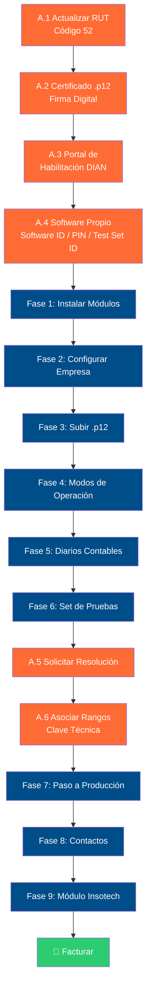

# Guía Maestra: Facturación Electrónica DIAN — Odoo 19

> Versión: 1.0 | Inicio: Marzo 2026 | Autor: Insotech S.A.S.

Guía completa de punta a punta para configurar facturación electrónica DIAN en Odoo 19 como Software Propio. Desde los trámites legales ante la DIAN hasta la operación diaria.

---

## Estructura del Instructivo

| Parte | Documento | Estado | Descripción |
|-------|-----------|--------|-------------|
| **A** | [PARTE_A_Tramites_DIAN.md](./PARTE_A_Tramites_DIAN.md) | ✅ Completo | Trámites ante la DIAN (Portal MUISCA) |
| **B** | PARTE_B_Configuracion_Odoo.md | 🔜 Próximo | Configuración en Odoo 19 (Fases 1-9) |
| **C** | PARTE_C_Operacion_Diaria.md | 📋 Pendiente | Operación diaria y troubleshooting |
| **APX** | APENDICES.md | 📋 Pendiente | Errores DIAN, limitaciones, glosario, checklist |

---

## Flujo General

**Leyenda:** 🟠 Trámites DIAN (Parte A) → 🔵 Configuración Odoo (Parte B) → 🟢 ¡Listo!
